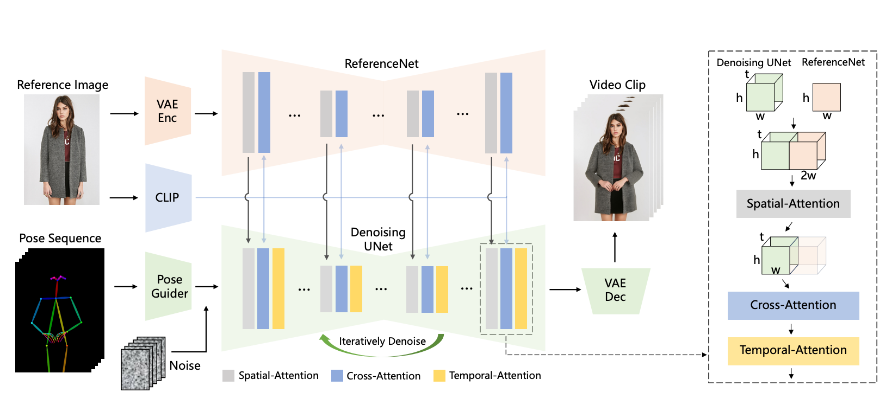
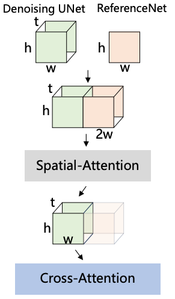
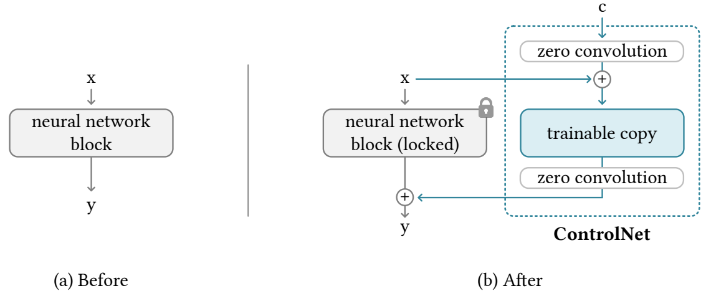
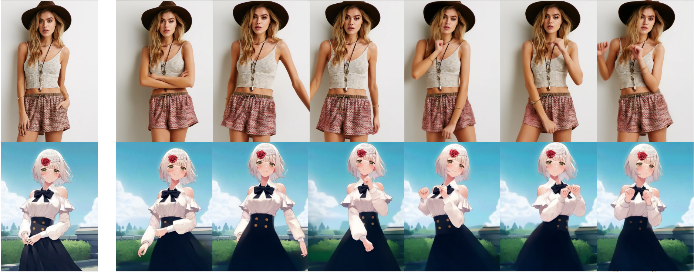
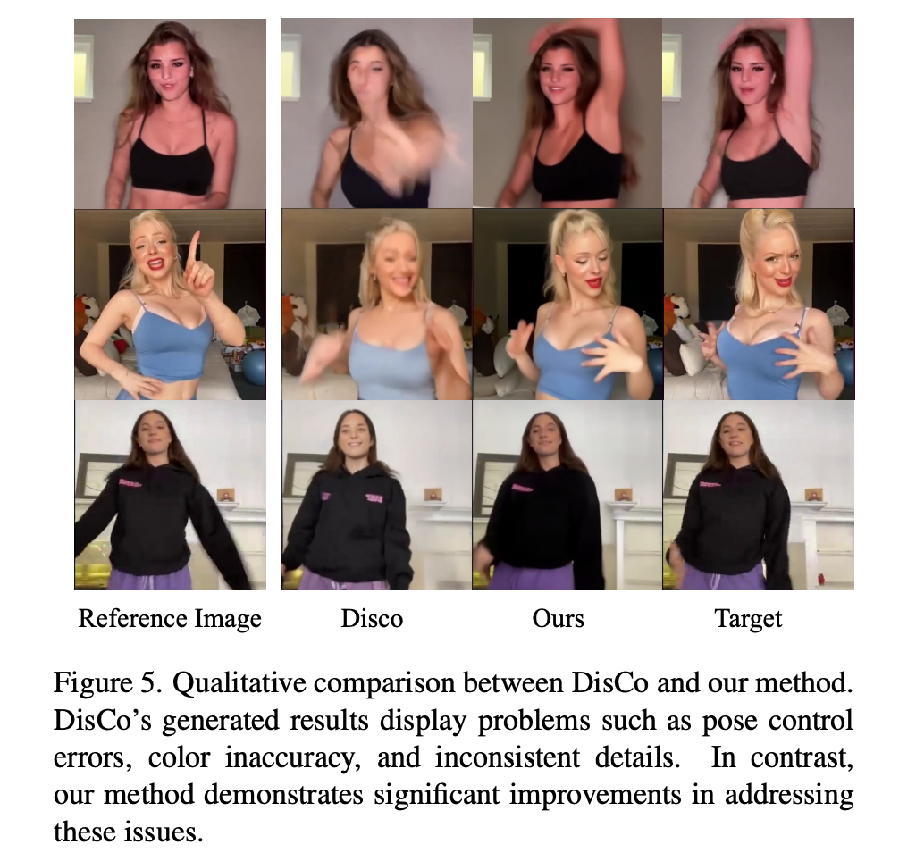

# Animate Anyone: Consistent and Controllable Image-to-Video Synthesis for Character Animation

[출처](https://www.aitimes.com/news/articleView.html?idxno=155678)

### 키워드
- Image to Video, Character Animation, Stable Diffusion
- Consistent generation 
- Temporal Attention, Spatial Attention

### Preview이자 전부

- 이미지 생성 모델인 stable diffusion(SD)를 활용해서 비디오 생성
  - 이미지는 2D, 비디오는 시간 차원이 추가된 3D
- 모델 구조
  - 입력: 포즈 시퀀스($t$ 개), 레퍼런스 이미지($1$ 개)
  - 출력: 레퍼런스 이미지에 포즈 시퀀스를 반영한 $t$ 초 비디오
- 3 가지 타입의 Attention 사용
  - Spatial-Attention, Cross-Attention, Temporal-Attention 사용
- SD 사용하기 위해 텐서의 (차원 축을 늘리는) repeat, (차원 축의 순서를 바꾸는) transpose, (차원 축을 합치는) reshape를 활용
  - Spatial attention 
   : 차원 축 늘리기 for 2D -> 3D 데이터 , 
    i.e. $[b,\; h*w,\; c]$ -> $[b,\; \mathbf{t},\; h*w,\; c]$
  - Cross attention 
   : 추가된 차원 축을 batch 차원 축에 합하는 방식 for 3D -> 2D attention
    i.e. $[b,\; t,\; h*w,\; c]$ -> $[\mathbf{b*t},\; h*w,\; c]$
  - Temporal attention
   : 차원 축 순서 바꾸기 for 시간 축을 고려한 attention 계산 
    i.e. $[b,\; t,\; h*w,\; c]$ -> $[\mathbf{b*h*w},\; \mathbf{t},\; c]$
- 레퍼런스 이미지의 디테일을 잘 반영하는 새로운 attention 결합 방식 제안
    => Spatial Attention Layer

  

## Introduction
- 캐릭터 애니메이션(Character Animation)은 레퍼런스 이미지에 포즈를 반영한 비디오를 생성하는 테스크 
- 지금까지 일관성(consistency)과 일반성(generalizability)을 동시에 만족하는 방법은 없었음
  - 일관성 문제: 동영상 내에 캐릭터 디테일들이 변함
  - 일반성 문제: 기존 방식들 소스 캐릭터 이미지에 대해 파인튜닝함
- 일관성과 일반성을 만족하는 AnimateAnyone 제안
- AnimateAnyone 방법 소개
  - (3D) Denoising Unet 
    - 비디오 생성 모델
    - __Temporal layer__ 추가
      - multi-frame inputs을 처리할 수 있는 변형된 SD Unet 구조 사용
    - __Spatial Attention Layer__ 로 self-attention 대체
      - 레퍼런스 이미지 정보 결합 레이어
  - __ReferenceNet__
    - for 일관성
    - SD Unet과 동일 구조
    - 레퍼런스 이미지의 spatial 정보 추출하고 denoising UNet에 결합하여 학습 => 레퍼런스 이미지의 디테일들을 더 잘 유지
  - __Pose Guider__
    - 포즈 시퀀스 인코더
    - Pose Guider가 추출한 features에 노이즈를 더해서 모델에 입력 => 원하는 포즈 반영
- 내부 5K 데이터셋으로 모델 학습하여 SOTA 달성.

## Method
  
- 주요 구성 요소: ReferenceNet, Pose Guider, Temporal Layer
- 모델 구조
  - 입력: 레퍼런스 이미지, $t$ 초의 포즈 시퀀스
  - 출력: $t$ 초의 비디오 
- 생성 프로세스
  - 포즈 시퀀스 -> PoseGuider -> 노이즈 더하기 -> N 번 * (Denoising UNet) -> 비디오
  - Denoising UNet에서 레퍼런스 features 사용
    - 레퍼런스 featuers : 레퍼런스 이미지 -> ReferenceNet -> 이미지

### ReferenceNet
- 기존의 방식들은 SD에 이미지 조건을 반영하기 위해 CLIP 텍스트 인코더를 CLIP 이미지 인코더로 대체하여 사용함.
- **디테일**을 잘 유지 못하는 일관성(consistency)의 문제가 발생
  - CLIP은 낮은 해상도(224x224)의 이미지로 학습됨, SD는 (512x512) 이미지 생성
  - CLIP 학습 방식이 semantic high-level feature matching 방식, 이미지 디테일 정보 손실 있음.
- 레퍼런스 이미지의 디테일 정보를 더 잘 유지하기 위해 **ReferenceNet** 제안
- ReferenceNet은 CLIP 이미지 인코더를 사용하는 (2D) SD 구조 모델 
  - 모델 SD 웨이트로 초기화
- **Spatial Attention layer**를 통해 (3D) Denoising UNet에 레퍼런스 features 결합함.

  1. 레퍼런스 features $t$ 번 repeat
  2. Denoising UNet features와 $w$ 축으로 concat
  3. self-attention 수행
  4. 원래 UNet features에 해당하는 부분의 features만 추출
- 장점
  1. SD의 feature modeling 능력 사용, 좋은 모델 초기화값
  2. ReferenceNet과 Denoising UNet이 feature space를 공유해서 학습이 쉬워짐
- ControlNet과의 차이점
  
  - 논문에서는 ControlNet의 조건(depth, edge)은 위치 align의 목적인데 여기서 레퍼런스 이미지는 위치 align이 목적이 아니기 때문에 적합하지 않다고 한다. 
  - 방식을 비교하자면
    - ControlNet은 attention 각자 수행 원래 output + 조건 output, dependent(연산량 2배)
    - AnimateAnyone은 원래 output과 조건 output concat하고 attention 수행한 뒤 원래 부분만 사용, independent(pre-compute 가능)
  - 번외) 최근 reference 용 ControlNet도 추가 되었다. attention layer에 직접 적용하는 다른 방식

### Pose Guider
- 포즈 조건을 주는 방식으로 ControlNet을 사용할 수 있지만, ControlNet은 연산량 2배됨 (dependent)
- light-weight 인코더 사용

### Temporal Layer
- Spatial-, Cross- Attention 뒤에 수행
- layer 자체는 AnimateDiff와 동일
  - Temporal Attention 
    - $[b,\; t,\; h*w,\; c]$ -> $[(b*h*w,\; t,\; c)]$ -> $t$ 축으로 self-attention 수행
- 일관성을 유지한 자연스러운 비디오 생성에 도움

### Training Strategy
- 2 단계
  - I stage: 레퍼런스 이미지로 타겟 포즈 생성 학습 (single frame)
  - II stage: 자연스러운 비디오 생성 (multi frames)

- I stage
  - 레퍼런스 이미지로 타겟 포즈 생성 학습 (single frame)
  - 레퍼런스 이미지는 비디오 클립에서 랜덤하게 고름
  - 학습 : denoising UNet(Temporal layer 배제), ReferenceNet, Pose Guider
  - 초기화
    - denoising UNet, Reference Net: SD로 initialize
    - Pose Guider: Gaussian 초기화, 마지막 projection layer는 zero conv

- II stage (consistency)
  - 자연스러운 비디오 생성 (multi frames)
  - 학습: Temporal layer in denoising UNet 
  - 초기화: AnimateDiff 모델 값

## Experiments

### Implementations
- 자체적으로 5K 캐릭터 비디오 클립 데이터 구축
- DWPose로 포즈 시퀀스 추출
- A100 4개 사용
- I stage: 768x768, center-cropped, 30,000 steps, 64 batch size 
- II stage: 24 frame, 10,000 steps, 4 batch size, 1e-5 lr

### 결과
- real, animation 도메인 다 가능

- 포즈 더 잘 반영

- 레퍼런스 더 잘 반영

