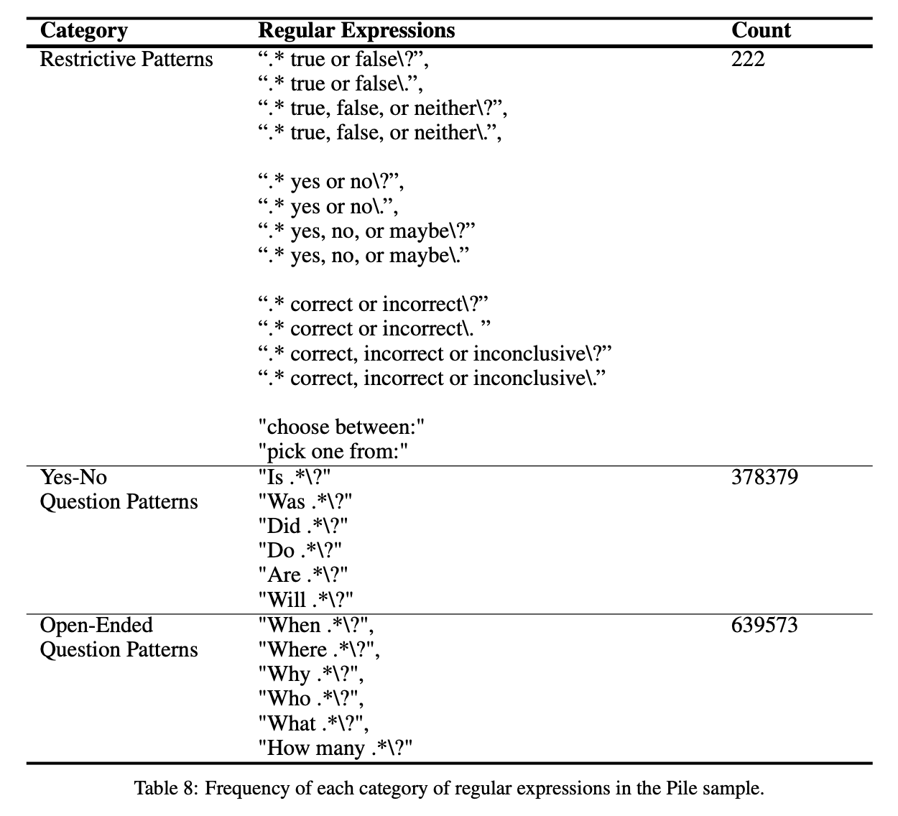
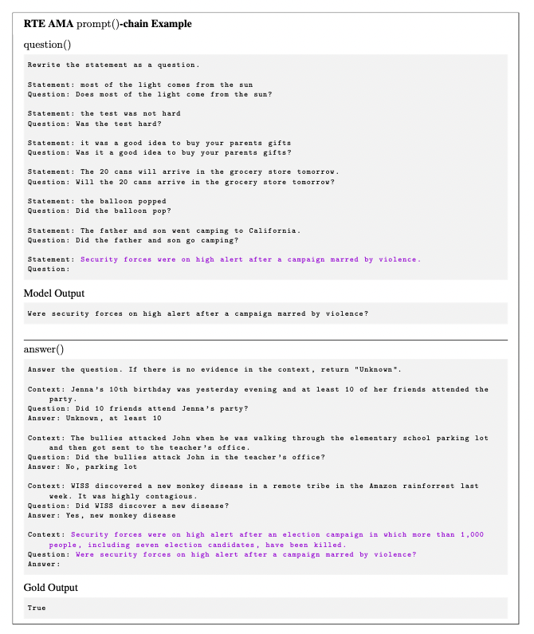
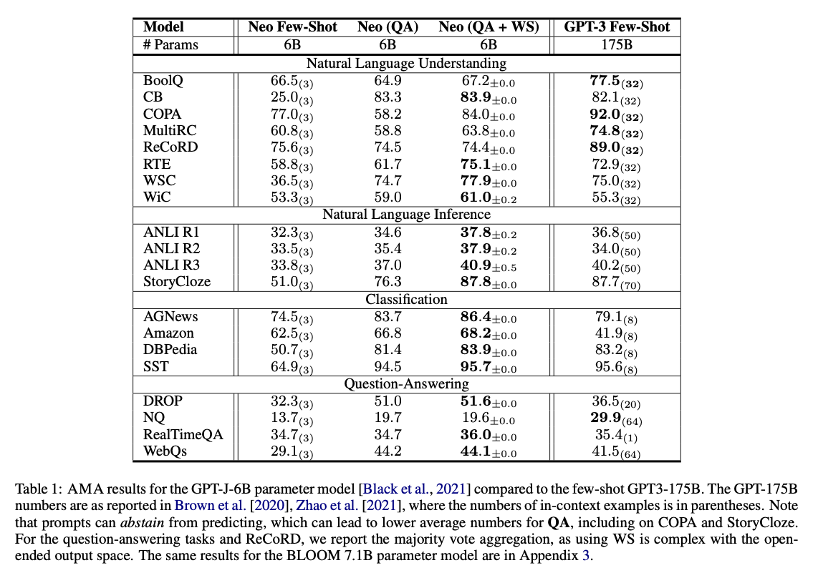

# Ask Me Anything: A simple strategy for prompting language models

### 키워드
- ICLR 2023 top 25%
- In-context learning
- Effective prompting

## 주관적인 Preview 이자 전부
- In-context learning에서 일반적(general)으로 사용할 수 있는 prompting 방법 제시
- 효과는 굉장했다! 
  - 6B 모델로 175B보다 뛰어넘거나 비슷한 성능!
  
- 주관적 입장: 앙상블로 정확도 높인 느낌 (\*\*: contribution)
  - 기존 프롬프트를 모델이 학습 시 많이 본 **\*\*QA 형태(QA Prompt Chains)\*\*** 로 여러 개 생성
  - 생성된 여러 답 중 그래프 구조의 weighted Majority vote 통해 최종 답 선택 (**\*\*weak supervision\*\***)
  
  - (번외) NLP의 self-consistency와 유사
- 분석이 굉장허다!
  - 모든 아이디어의 근거가 있음, 엄청난 새로운 아이디어가 있는 건 아니지만 연구적으로 좋은 논문

## Introduction
- LLM은 in-context learning 가능하지만 프롬프트를 어떻게 설정하는지에 따라 성능 차이가 크다
  - 작은 프롬프트 변화 → 성능 큰 variation
  - 모델-by-모델, task-by-task 프롬프팅 필요
  - 좋은 성능을 위해 perfect prompt가 필요
  - 권고 사항이 사람이 메뉴얼하게 찾는 것 ⇒ Nooooooooooo!
- 목적
  > This work instead consider `aggregating` the predictions of `multiple effective`, yet `imperfect, prompts` to improve prompting performance `over a broad set of models and tasks`.
  >
- 고려할 점
  - Effective prompts 
   : 여러 task와 여러 모델에 잘 동작하는 프롬프트 format 찾기
  - Scalable collections
   : task를 reformatting해서 여러 개로 만드는 전략
  - Prompt aggregation (Multi-Head Attention 느낌)
   : 정확도와 의존성(?)을 고려하는 Majority Vote 전략

## Method
## 1. Effective Prompt Formats!
- 태스크, 모델(종류,크기)에 전반적으로 잘 작동하는 효과적인 프롬프트 포맷 찾기
- 이전 연구를 참고하여 3가지 포맷을 실험
  - restrictive question : 아웃풋 형태 제한
    > John invited Mark to come watch Jarassic Park. Output True or False?
    > 
  - cloze-question : 빈칸 채우기
    > John invited Mark to come watch Jurassic _
    > 
  - free-form question (traditional QA): yes-no, Wh 형태
    > Where did John invite Mark?
    >
- 결과

- open-ended > restrictive
  - open-ended(cloze, free-form QA)
  - 모델 크기에 따른 relative gain이 적다 ⇒ 전반적으로 잘 동작한다
- open-ended 단점: 원하는 아웃풋 class로의 mapping이 요구될 수 있다.
  - ex. 글 종류 분류 task에서 open-ended 아웃풋이 ‘journal’,
    하지만 원하는 아웃풋 class에는 journal이 없음
    -> **mapping** 프롬프트 : A ‘journal’ maps to category: written work
- QA가 더 좋은 이유?
  - foundation 모델의 편향된 데이터셋, open-ended가 훨씬 많음
  - 즉, foundation 모델이 많이 본 형태로 입력하는 것이 좋다. 특히 모델 크기가 작은 경우 더 그럼. 
     (6B는 애기에요)
  

### AMA's prompt format
1. (question) : LLM이 input을 question으로 생성
2. (answer) : 생성된 question으로 LLM으로 답 유추

## 2. Creating Prompt Collections at Scale
- multiple QA 프롬프트 생성하기
  - 다각도의 정보 수집하고 답 추출 ⇒ 성능 향상
    - ex. Who went to the park?, Did John go the park?, Where did John go?
  - multiple QA ⇒ prompt()-chain, task 상관없이 적용되기 때문에 functional 형태
    - 하지만 코드를 보면 task 별 in-context prompting이 상당함...
    - mapping 프롬프트도 허점...
- prompt()-chain
  
  - question(): $x \rightarrow q$ , input $x$로부터 ***qeustion*** $q$ 생성
    - in-context demonstration, style of question
  - answer(): $q \rightarrow a$,  생성된 question $q$에서 후보 답 $a$ 생성
- prompt()-chain 예제
  

## 3. Prompt Aggregation
- prompt predictions을 하나의 아웃풋으로 aggreate 
  ⇒ 그래프 구조의 weighted Majority vote 사용
- 그래프 의존도 구조와 정확도 예측 모델을 weak supervision으로 학습
  - 과정이 복잡하나 새로운 아이디어를 제시한 것은 아니고 기존 있었던 방법을 고대로 결합
  - 의존도, 정확도 학습이 attention weight와 비슷한 것 같음. task와 질문의 관련도/중요도를 고려할 수 있는 방식인 것 같음
### Aggregation 방법
  
1\. 의존도 그래프 $G$ 학습
  - 학습 데이터: 데이터로 만든 question의 예측 집합(set) $\mathbf{P}(x)$, 
    - 즉, answer()-chain
  - 학습 방식: weak supervision, [Varma et al [2019]](!https://arxiv.org/abs/1903.05844)
    - [Learning Dependency Structures for Weak Supervision Models](!https://arxiv.org/abs/1903.05844)

2\. 정확도 예측 모델 $Pr_{G,\theta}$ 학습
  - 학습 데이터: 학습된 의존도 그래프 G, G의 학습 데이터 $\mathbf{P}(x)$
  - 학습 방식 : weak supervision, [Ratner et al. [2018]](!https://arxiv.org/abs/1810.02840)
    - [Training Complex Models with Multi-Task Weak Supervision](!https://arxiv.org/abs/1810.02840)

3\. 정확도 예측 모델의 확률값을 가장 크게하는 아웃풋 선택
 
### Notation
- $\phi_{WS}= argmax_{y \in Y} Pr_{G,\theta}(y,\mathbf{P}(x))$ : aggregator
- $Pr_{G,\theta}(y,\mathbf{P}(x))$ : 확률 그래프 모델
  - $\mathbf{P}=[p_1, p_2, ..., p_m]$: m 개의 question 프롬프트
  - $\mathbf{P}(x)=[p_1(x), p_2(x), ..., p_m(x)]$ : 입력값 $x$에 대한 question 프롬프트의 예측값
  - $G=(V,E)$ : 의존도 그래프
      - $V=\{y, \mathbf{P}(x)\}$
      - $(p_i(x), p_j(x)) \in E: edgeset,\;\;\; iff \;\;\;p_i(x),p_j(x): cond.\; indep.\;\; given\; y$
  - $\theta$ : 정확도 예측 모델의 파라미터

## 전체 아키텍쳐

- QA 형태의 (multiple) prompt chain
- 그래프를 사용한 Aggregator, 학습 시 WS(weak supervision) 사용

## Experiments
- 결과
  - classification task들...
  
- Error Analysis
  - Instruction-following errors: 특정 원하는 output space(ex.classification) 결과로 안나오는 경우
  - Knowledge errors: Factual, Commonsense 에서는 성능 크게 오르지 않음
  - Long-context errors

## 얻을 수 있는 insight
- 크기가 작은 모델로 성능을 내고자 할 땐 그 모델을 학습했던 데이터 형식을 사용하자
- 그래프를 weak supervision으로 학습하고, weighted majority vote 할 수 있음
  - 일종의 attention weight
  - 답변에 더 도움되는 질문에 더 높은 가중치를, weak supervision으로 학습
  - 의존도 그래프 학습의 필요성?
    - 더 좋은 initialization이 될 수도 있을 것 같음 for faster, easier training

## Reference
- https://tungmphung.com/advanced-yet-simple-prompt-engineering-techniques-for-large-language-models/
- https://velog.io/@mmodestaa/Ask-Me-Anything-A-simple-strategy-for-prompting-language-models
- https://www.youtube.com/watch?v=CD3exXnx49A

