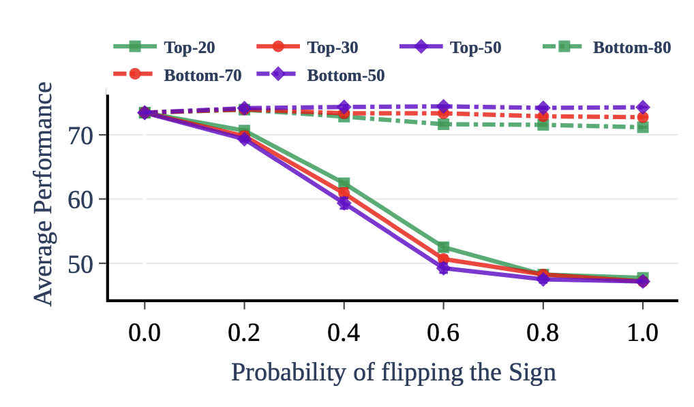

# Ties-Merging

## Description
### 간단 요약
* weight average는 간섭 문제가 있음.
* 이 간섭을 해결하기 위하여weight average 하기 전에 trim과 sign matching을 해줌.
---
* name: TIES-MERGING: Resolving Interference When Merging Models
* link: https://arxiv.org/abs/2306.01708
* date: 23.06 (arxiv)
* code: https://github.com/prateeky2806/ties-merging

# Introduction

현재와 같은 1태스크 1모델 시스템의 문제점
1) 매 태스크마다 새로 학습해야 함
2) 이미 학습된 모델은 개선이 어려움
이 문제점을 해결하기 위해 보통 Multitask Learning이 들어가지만, 1) 모든 태스크에 대한 데이터가 있어야 한다. 2) 데이터 섞는 비율도 중요하다 3) 자연스럽게 데이터가 커지므로 학습 cost도 적지 않다

그래서 등장한 것이..
## Weight Merging

일반적으로 모델 병합은 여러 태스크로 튜닝된 모델을 하나로 합쳐 큰 general 모델로 만드는 것을 의미한다. MoE 같은 방식과는 다르게 모델이 하나로 합쳐지기 때문에 저장 용량이 적다는 장점이 있다
병합은 
1) weight을 전부 더하거나
2) weight을 average하거나,
3) average할 때 각 weight의 priority를 좀 고려하도록 하거나

등등이 있다. 자세한 것은 위의 서베이를 참조하면 좋을듯

어쨌든 위의 방식들은 결과적으로 weight를 섞는 것이기 때문에 서로 다른 모델 사이에 간섭이 생기는 경우, 성능 저해를 야기할 수 있다.

이 논문에서는 이 **간섭**의 원인에 대해서 우선 분석하고 있다.

### 1) 중복 parameter로 인한 간섭 발생
(양측 그림의 동그라미 부분)
동일한 parameter에서 한 모델은 중요한 값(보라색)으로 표기했는데 다른 모델은 그렇지 않은 값(분홍색)으로 표기한 경우, 보라 값이 묻히게 된다(오렌지색)

### 2) Sign disagreement로 인한 간섭 발생
동일한 parameter에서 한 모델은 양수(보라색), 한 모델은 음수(분홍색)으로 마킹하는 경우, 두 값의 평균은 원 값보다는 자연히 줄어들게 된다.

두 원인 모두 전체적으로 모델 간의 간섭으로 인해 **유의미한 값의 차이가 사라지게 된다(smoothing)**는 결론을 가리킨다. 

## Related Work

### Model Fusion
* survey: Deep Model Fusion (2023, arxiv) 를 참고
이 논문에서는 퓨전 방식을 대략 4가지로 구분하고 있음
1. Model Connectivity: weight interpolation (interpolation함수를 학습)
2. Alignment: A모델을 B모델에 맞게 최대한 align한 뒤 average
3. Weight Merging: aA + bB + ...
4. Ensemble

이 논문은 Task Arithmetic이라는 Weight Merging 기법을 발전시킴. 여기서 task vector라는 개념이 나오는데, 이는 튜닝된 모델과 기존 모델과의 차이(task space로 향하는 방향)를 나타냄. 두 벡터를 잘 조합하면 모델을 general space로 향하게 할 수 있다는 가정.

# Method: Ties-Merging (Trim, Elect Sign & Merge)

각각의 모델 parameter값들을 $\theta_{t}, t \in [1...n]$ 라고 할 때, task vector는 모델의 초기 parameter값 $\theta_{init}$ 과 각각의 $\theta_t$ 간의 차로 정의된다.

이 task vector를 통해 최종 모델 parameter 값인 $\theta_{m}$을 만드는 것이 목적

간단히 설명하면
1) top-k로 각각의 task vector 값을 자르고
2) 벡터 방향을 다수결로 결정하고
3) 그 방향에 해당되는 벡터값들을 합쳐서 최종 task vector를 만들고
4) 최종 vector로 $\theta_m$ 만들기 뿅

1)에서 top-k로 값을 잘라 버리면 모델의 성능이 떨어지지 않을까?라는 의문에 대한 실험

## 상세
#### definition
* task vector: $\tau_{t} = \theta_{t} - \theta_{init}$ 
* sign vector: $\gamma_{t} = sgn(\tau_t), sgn(x) \star |x| = x$ 
* magnitude vector: $\mu_t = |\tau_t|$
* $\tau_t = \mu_t \odot \gamma_t$

#### 구현

1. Trim
   * 각각의 모델에 대하여 top-k의 task value만 유지
   * $\hat{\tau_t} = \text{keep\_topk\_reset\_rest\_to\_zero}(\tau_t, k)$

2. Elect Sign
   전체 task vector의 magnitude가 커지는 방향으로 sign vector를 재조정
   $\gamma_m = sgn(\sum_{t=1}^{n}{\hat{\tau_t}})$

3. Disjoint Merge
   위에서 계산한 sign vector 방향의 모든 magnitude를 average
   $\mathcal{A}^p = \left\{ t \in [n] | \hat{\gamma_t^p} = \gamma_m^p \right\}$
   

마지막으로 최종 $\theta_m$ 구하기
   $\theta_m = \theta_{init} + \lambda \star \tau_m$
$\lambda$ 값은 scaling hyperparameter

# Experiments

1. 다른 방식에 비해 튜닝 시 성능이 좋음
	같은 데이터로 튜닝된 여러 모델들 (e.g. 허깅페이스에 있는 무수히 많은 QA모델)을 사용하는 경우 더 좋은 성능을 낼 수 있음
2. 이 모델을 초기 모델로 잡는 경우 튜닝 시 성능도 더 좋아짐

### 분석

* 각각의 효과를 알아보기 위해 trim / elect 중 하나만 써서 실험하였음. 
* 좌): 1개일 때랑 1개보다  많을 때랑 비교해도 크게 달라지지 않는다 = 작은 value에 의해 shrink되지 않는다.
* 우): parameter끼리 sign이 갈리더라도 평균 magnitude가 기존보다는 유지됨(보라)

* top-N / bottom-N 의 sign vector를 특정 확률(x축)로 뒤집어줌.
* top-N은 반대 방향으로 갈수록 성능이 급격히 떨어진다 (= sign interference를 주의해야 한다 & top-N은 중요하다 & bottom은 쓸다리가 없으니 trim해도 좋다)

* ablation study.

# Discussion
* 실험이 T5로 진행됨. 실제 llm에서 어떻게 작용하는지는 이 뒤에 나오는 논문인 lm-cocktail을 찾아봐야 할 것으로 보임.
* 현재 가장 많이 쓰이는(open-llm-leaderboard 기준) SLERP방식은 따로 비교하지 않았다는 점? cocktail논문에서는 이걸 다루고 있을 지 궁금
* 실험에서 초기 모델로 썼을 때 성능이 올랐다고 하는 것을 봐서, 지금 나온 solar inst 모델들을 기반으로 하고 거기다가 디피오나 셀프 inst등을 멕이면 더 잘 하지 않을까..? 하는 소소한 의문