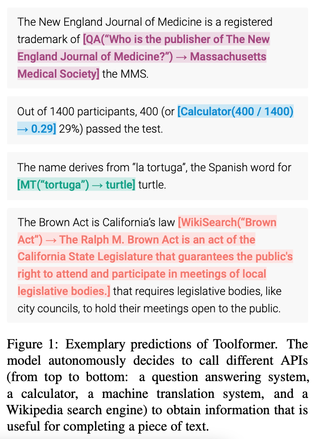
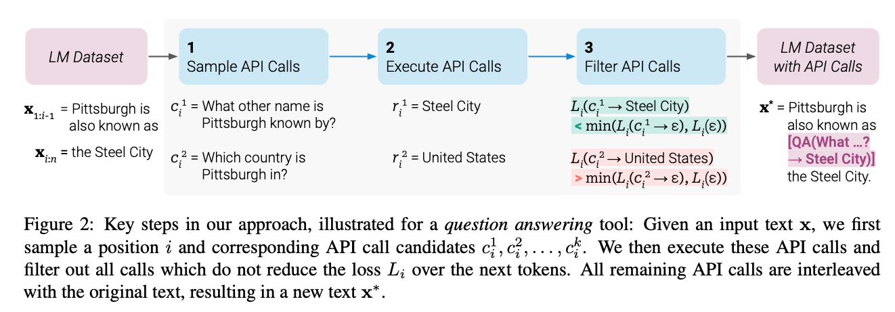
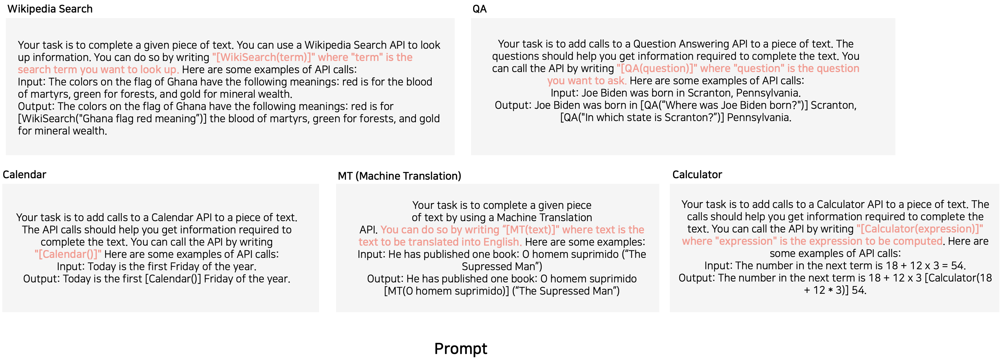
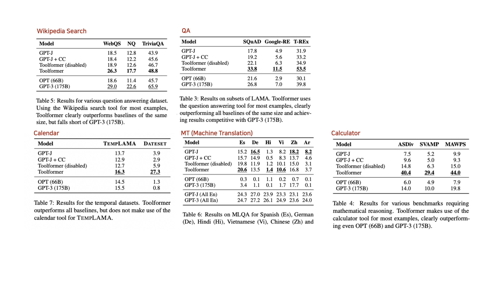

# Toolformer: Language Models Can Teach Themselves to Use Tools
## Overview
* Meta AI 2022
* 공식 구현 X 
* LLM(GPT-J, 6B)가 언제/어떤 API를 어떻게 호출할지 스스로 결정하는 방법
* **self-supervised** 방식으로 데이터를 쉽게 생성함
* 총 5가지의 Tool(API)를 사용
  * QA(RAG), Wikipedia Search, Calculator, Calendar, MT(Machine Translation)

## Introduction
* LLM이 가지고 있는 기본 한계
  * 최신 정보 활용, 환각
  * 저자원 언어 이해
  * 수학 스킬
  * 시간 경과 (오늘, 내일 등)

* 이를 해결 하기 위한, 가장 간단한 방법은 외부 tool을 사용 하는 방법
* 최근 Tool을 사용하는 방법은 다음과 같은 한계
  * 사람의 labeling 필요.
  * 또한 Tool이 고정되어 있어 다양한 Tool를 사용 불가

* 따라서 Toolformer에서는 Self-supervised 방식으로 직접 데이터 셋을 만들어 학습에 활용하고, 5개의 Tools을 사용할 수 있도록 함.

## Method
* ToolFomrer 목표
  * Self-supervised 방식으로 사람의 Labeling 필요 X
  * API call을 호출할 수 있는 LLM model M을 만드는 것.
    * 언제 / 무엇을 / 어떻게 사용할지를 결정

* 위의 목표를 수행하기 위해서 1) Annotation -> 2) Filtering -> 3) FT(Fine Tuning)

* 여기서는 API calls을 다음과 같이 linearlize해서 나타냄 
  * $\<API> a_c(i_c) -> r \</API>$
  * -> , \<API>, \</API> s는 모두 special toekn 
* 원래 데이터 셋 $C$ 가 주어지면, 위의 표현 API calls로 Augmented 된 $C'$ 를 생성 후, $C'$을 활용해 LLM을 FT

### 1. Sample API Calls
* 가장 첫번째 API를 **언제** 부를지 결정
  * 즉 input x에 대해서 언제 API call를 하는 게 확률이 높은지 대해서 계산을 진행
* Few-shot prompt(하단 참고)를 활용해서 input x에 대해 API call를 annotate

* 이때 모든 위치 $i$에 대해서 모두 진행 (모든 API 종류에 대해서) 그 후 확률 값으로 필터링 진행 후 API 호출(최대 Top-k개)
  * $p_i = p_M(\<API> | P(x), x_{1:i-1})$
  * $I = {i|p_i > \tau_s}$

* API calls 위치에 최대 M개의 다른 API calls 생성
  * 최대 5 * k (위치 최대 개수) * m(sampling 개수)개 생성.
  * 이때 형식이 안맞는 것은 discard
  * 

### 2. Execute API Calls
* 1번의 과정으로 얻은 모든 potentail API calls 실행해서 결과 얻어옴
  * 각 tools에 따라 다른 실행과정 (Appendix 참고)

### 3. Filter API Calls
* 1, 2번에서 API calls를 포함한 데이터 셋을 만들었다면 그 데이터 셋을 필터링하는 과정
* Loss 값 활용
* API call과 response가 모델에 주어진 경우의 Loss와 반대되는 Loss를 비교해서 필터링 진행
  * $L_i^+ = L_i(e(c_i, r_i))$
  * $L_i^- - min(L_i(\varnothing), L_i(e(c_i, \varnothing))$
  * 반대되는 로스(-) 는 API call이 없는 경우, reponse가 없는 경우 중에 작은 걸 선택
* 두 개의 Loss 차이가 일정 임계값보다 넘으면 선택 진행
  * $L_i^- - L_i^+ \geq \tau_f$

### 4. Finetune LLM with augmented dataset(with API calls)
* 앞선 단계를 다 거친 후 최종 API call과 원래의 input을 합쳐서 새로운 $C'$ 데이터 셋 생성
* $'C'$와 $C$는 API call 부분을 제외하고, 원래 text와 동일함 
  * LLM이 사전학습때 본 데이터, 사전학습때 사용한 학습 방식으로 친숙함.
* $C'$을 활용해서 FT 진행

## Experiment

## Conclusion
* self-supervised 방법으로 데이터를 쉽게 생성하고, 필터링을 적용해서 퀄리티가 보장되는 것 처럼 보임.
  * 실제로 데이터 생성 퀄리티를 실험 예정
* 이미 LLM이 잘하는 다음 단어 맞추기로 FT를 진행함

