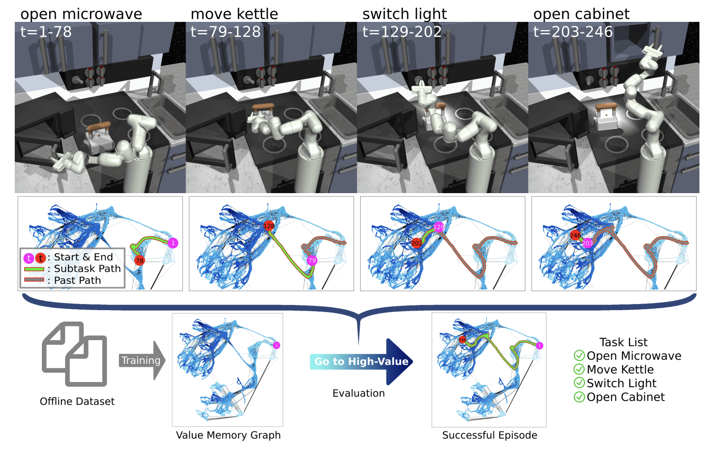
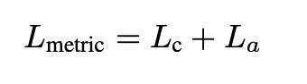
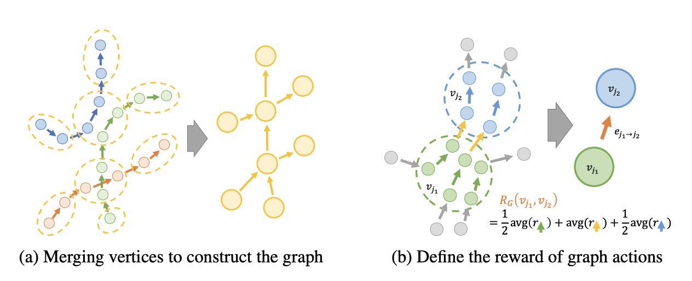
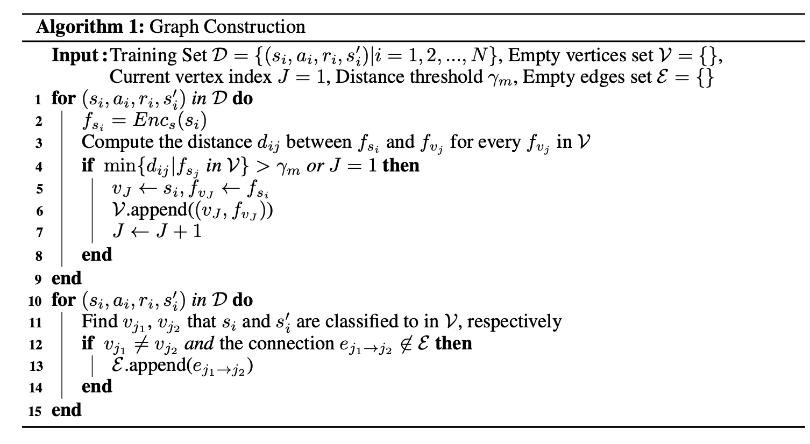
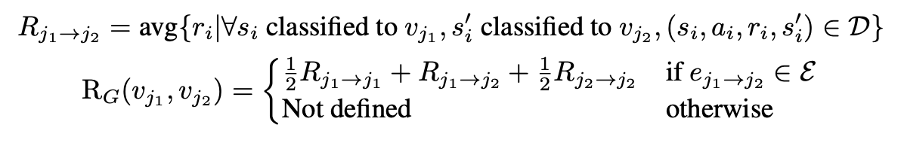
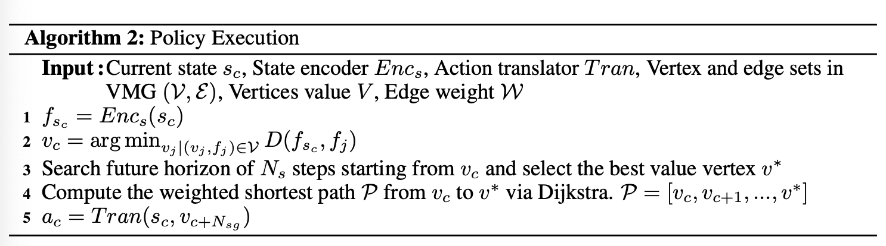
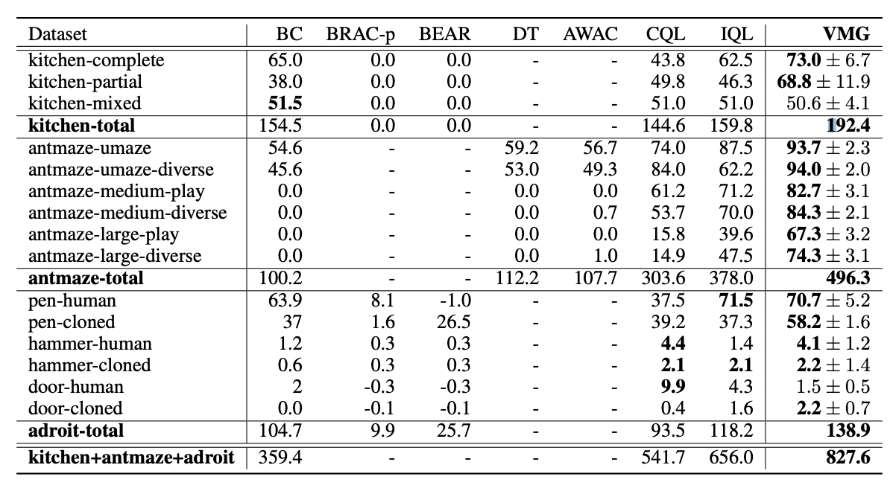
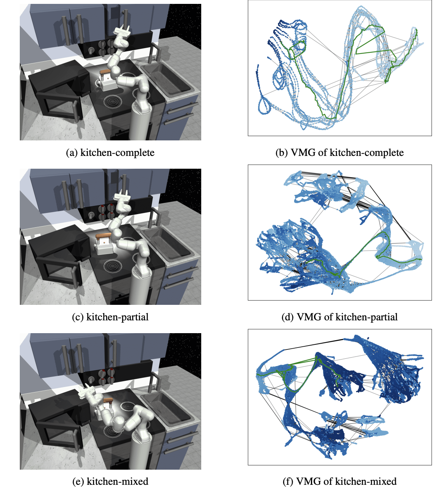

# Value Memory Graph: A Graph-Structured word model for offline reinforcement learning

> Editor: [민예린 (Yerin Min)](https://www.linkedin.com/in/yerinmin/)  
>
>

## 1. Introduction

- 사람이 의사 결정을 할 때는 일반적으로 사소한 정보는 무시하고 중요한 정보에 더 집중함으로써 어려운 문제를 단순화함.
    - 일반적으로 RL methods는 original environment 에서 직접 상호작용하며 policy를 학습함.
    - 그러나 robotics나 video games과 같이 long temporal horizons/sparse reward signal/large and continuous state-action space를 가지는 복잡한 환경에서는 기존 RL methods를 이용하여 state 나 action의 가치를 잘 추정하고 well-performing하는 policy를 얻기가 어려움.
    - 복잡한 original environment를 단순화하기 위한 **world model**을 학습하여 policy training **난이도를 낮추면서 더 좋은 성능**을 기대할 수 있음.

- 이와 같은 **world model 이 본 논문에서 제안하는 Value Memory Graph(VMG)**임.
    - VMG는 특히 Offline RL을 위한 graph-structured world model로, original environment 를 추상화할 수 있는 graph-based MDP를 의미함.
        - Offline RL은 미리 수집된 episodes dataset 을 활용하여 policy를 학습하는 방법론임.
        - episode는 original environment의 dynamic information을 포함하고 있기 때문에, offline dataset을 활용하여 offline RL environment의 추상화를 직접 학습하는 것도 가능함.
    - VMG를 먼저 학습한 후에 RL methods에 적용하는 방식으로 환경 대체제로서의 기능을 함.

- 본 방법론의 contributions는 4가지가 있음.

1. VMG는 offline RL 에서의 graph-structured world model임. VMG는 상태적으로 작고 discrete 한 action과 state space를 가진 graph-based MDP로 original environments를 표현함.
2. contrastive learning 과 state 병합을 통해 offline dataset 에서 VMG를 학습하고 구축하는 방법을 디자인함.
3. 본 논문은 VMG 기반의 방법으로 value iteration을 통해 높은 미래 가치를 가지는 graph actions을 추론하고, 이를 action translator를 통해 실제 action으로 변환하여 agents를 control함.
4. D4RL 벤치마크 실험 결과, VMG는 sparse reward와 long temporal horizons을 갖는 몇몇 goal-oriented tasks에 대해 SOTA를 능가하는 성능을 보임.

[관련 키워드]
💡 #Offline RL 
#Hierarchical RL 
#Model based RL 
#Graph from Experience 
#Representation Learning
 

## 3. Value Memory Graph (VMG)

- VMG를 구축하기 위해서는 먼저 environment states간의 도달 가능성(reachability)를 측정하기 위한 metric space 를 학습함.
- 그런 후 VMG의 backbone으로 dataset의 metric space가 graph에 구축된다고 함.

→ 결론적으로 MDP는 environment의 추상적인 표현 형태로(abstract representation) graph에 정의되게 됨.

### 3.1 VMG Metric space learning
---

- VMG는 few time steps이 진행된 후에 어떤 state가 다른 state에 도달할 수 있는지를 나타내는 L2 distance 를 기반의 metric space 에서 구축되어 있음.
    - metric space 의 embedding 은 아래 그림처럼 Contrastive learning 메커니즘을 기반으로 함.

- 본 논문은 2개의 neural networks를 사용함.
    - **state encoder** $E_{nc_s} : S \to f_s$ : original state를 metric space 내 state feature로 변환.
    - **action encode**r $E_{nc_a} : f_s,a \to \Delta f_{s,a}$ : original action을 metric space 내 transition $\Delta f_{s,a}$ 으로 변환.
        - action encoder는 current state feature $f_s$ 에 따라 metric space 내 에서 original action a를  $\Delta f_{s,a}$로 변환함.
    
    → $\tilde{f_{s'}}=f_s+\Delta f_{s,a}$
    
- State encoder (contrastive loss)
    - 예측된 next state $\tilde{f_{s'}}$가 ground truth $f_{s'}$와 가까워지게 학습됨.
        
        
        
        - D: L2 Distance
        - $s_{neg,n}$ : n-th negative state
        - m : margin distance. 학습 때 offline dataset에서 $(s_i, a_i,s'_i)$ 가 randomly sampling 되는데, 이때 fixed margin distance가 이용됨.
            - 모든 다른 next states $s'_{j|j\not=i}$를 negative states로 사용하고 $\tilde{f_{s'_i}}$가 metric space 에서 최소 m만큼 떨어져 있도록 함.
            
            → 즉 m을 이용하여 예측된 $\tilde{f_{s'}}$ 가 ground truth $f_{s'}$ 외 다른 states와는 최소 marin distance 만큼 멀어지도록 함. 
            
    
- Action encoder
    - action decoder $Dec_a : f_s, \Delta f_{s,a} \to \tilde{a}$ 를 통해 transition $\Delta f_{s,a}$ 로부터 action reconstruct 함.
        - 이런 conditioned auto-encoder structure는 $\Delta f_{s,a}$ 가 action을 더 잘 representation 하도록 함.
    - 또한 인접한 states가 metric space 내에서 더욱 가까워지도록 하기 위해  transition $\Delta f_{s,a}$가 margin distance m 보다 클 때 페널티를 부과하는 loss 를 추가함.
        - . (인접한 상태가 계속 가까운 상태를 유지해야만 agent 의 이동을 쉽게 한다고 하는데 …)
    
    
    

- total training loss는 위 두 losses를 sum 한 형태로 이용함.
    
    
    
 

### 3.2 Construct the graph in VMG
---

- Graph 구성 방법
    
    
    
    1. VMG에서 graph를 구성하기 위해서는 먼저 training data 내에 있는 모든 episode를 directed chains 형태인 metric space 로 맵핑함.
    2. 그런 후 위 그림 (a) 처럼 state features의 수를 줄이기 위해 episode chains 을 결합함.
        - 이때 metric space 내에서 distance 를 기반으로 유사한 state feature를 하나의 vertex로 병합.
    3. metric space 내에서 existing vertices에서 checking state $s_i$ 까지의 최소 distance 가 주어진 thresh hold $\gamma_m$ 보다 작은지 확인함.
        - 만약 vertex set 이 비어 있다면 checking state $s_i$를 새로운 vertex $v_J$로 설정하고, vertex set $V$에 추가함.
        - 위 과정을 모든 dataset 에 대해 반복하여 vertex 를 구성함.
    4. 3을 통해 Vertex set $V$가 구성되고 나면, 각각의 state $s_i$는 metric space 내에서 distance 가 $\gamma_m$보다 작은 vertex $v_j$로 분류할 수 있음.
        - training dataset 에서 each state transition $(s_i,a_i,s'_i)$는 $s_i$에서 $s'_i$로 가는 directed connection 으로 표현됨.
        - 따라서 original transition 으로부터 graph directed edges를 생성함.
 

### 3.3 Define a graph-based MDP
---

- graph reward
    
    
     

### 3.4 How to use VMG

---

- VMG는 action translator 로 environment actions을 생성하여 episode 의 returns를 최대화하는 agent 를 생성할 수 있음.
    - classical RL 방법인 value iteration을 통해 각 graph state $v_j$의 value $V(v_j)$를 계산함.
        - 이때 VMG의 finite and discrete state-action spaces로 인하여, 학습하지 않고 1초 이내에 value 를 계산할 수 있다고 함.
    - agent가 좋은 행동을 취하도록 VMG는 각 time step에서 high-value graph states로 이어지는 graph action을 제공함.
        - 하지만 offline dataset 과 environment 간의 distribution shift 로 인하여 VMG와 실제 environment 사이에는 차이가 존재할 수 있고,
        - VMG에서 직접 value iteration을 통하여 계산된 최적의 graph action은 original environment에서는 최적이 아닐 수도 있음.
    - 따라서 **본 논문의 저자들은** greedy next state value가 큰 graph actions을 선택하는 대신, **먼저 여러 단계를 서치한 후에 좋은 future state를 찾고 path 를 planning 하는 것이 더 안정적인 성능을 보장한다는 것을 깨달았다고 함.**

- Policy Execution
    - 주어진 current environment state $s_c$에서 인접한 graph state $v_c$를 찾고,
    - $v_c$로부터 시작하는 search를 통해 best value 를 가지는 future graph state $v^*$를 찾음.
    - 그리고 $v_c$에서 $v^*$로 가는 shorted path $P=[v_c, v_{c+1}, ..., v^*]$를 Dijkstra algorithm으로 Planning 함.
    - $N_{sg}$-th graph state $v_c +N_{sg}$ 를 선택하고, searched graph action인 edge $e_{c \to c+N_{sg}}$를 생성함.
    - action translator를 이용해 graph action $e_{c \to c+N_{sg}}$를 environment action $a_c$로 변환함.
        - action translator는 offline dataset 을 이용하여 surpervised learning 으로 학습함.

## 4. Experiments

- D4RL 벤치마크를 활용한 실험

    

## 5. Future works

- 환경 구조의 다양한 수준을 모델링하기 위해, 계층적인 그래프 구축은 환경을 더 잘 표현할 수 있는 방법이 될 것 같음.
    - 예를 들어, 로봇이 요리를 할 때 야채 세척, 컷팅 등 단계별 작업을 진행하야 하는 경우 계측적인 구조가 유용할 것으로 예상.
- 지속적으로 그래프를 확장하고 새로운 정보를 포함하기 위한 메카니즘이 필요함.
- 탐색을 보다 효과적으로 하기 위해 MCTS를 사용하면 도움이 될 것 같음.

---

## Appendix

- hyper-params setting
    
    
    

- influence of margin distance
    
    